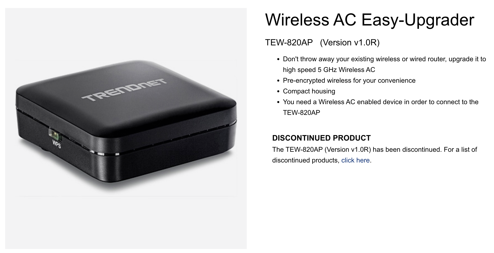
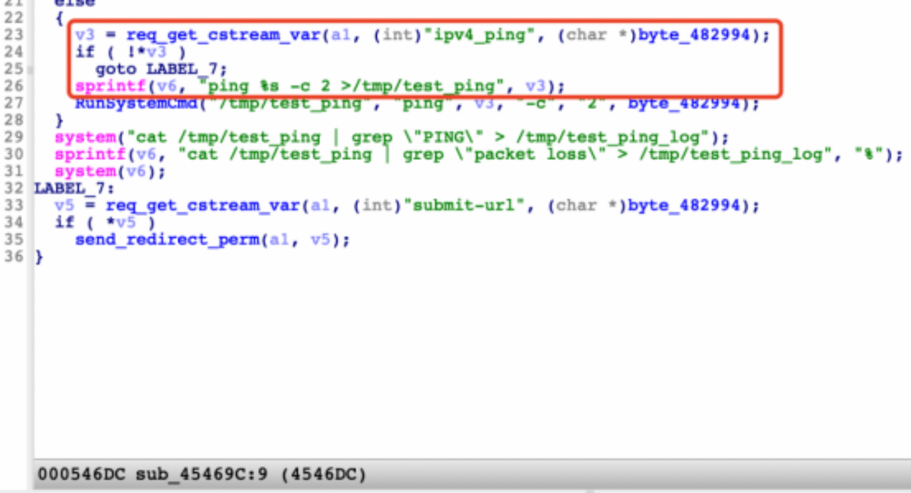
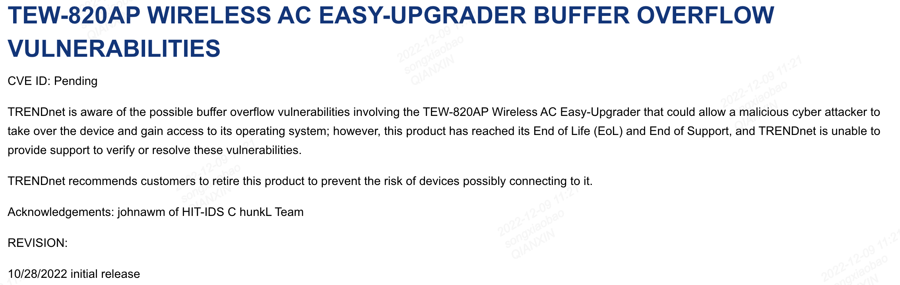

# Overview

Vendor of the products:         TRENDNet  (https://www.trendnet.com/)

Reported by:                    johnawm of HIT-IDS ChunkL Team

Product:                        TRENDNet TEW-820AP (Version v1.0R)

Affected Version:               TRENDNet TEW-820AP 1.01.B01

Firmware:                       https://downloads.trendnet.com/tew-820ap/firmware/tew-820apv1_(fw1.01b01).zip



# Vulnerability Details

A stack overflow vulnerability exists in TrendNet Wireless AC Easy-Upgrader TEW-820AP (Version v1.0R, firmware version 1.01.B01) which may result in remote code execution or denial of service. The issue exists in the binary "boa" which resides in "/bin" folder, and the binary is responsible for serving http connection received by the device. While processing the post reuqest "/boafrm/formSystemCheck", the value of "ipv4_ping" parameter which can be arbitrarily long is copied onto stack memory by "sprintf" function (as shown at line 23-26 of Figure A), and could lead to a buffer overflow. The attackers can construct a payload to carry out arbitrary code attacks.



Figure A: The decompiled code which is vulnerable.

# Reproduce and POC

To reproduce the vulnerability, the following steps can be followed:

1. Start frimware through QEMU system or other methods (real device)
2. Use the default username and password to login web.
3. Execute the poc script POC_for_formSystemCheck.py as follows:

```bash
python3 POC_for_formSystemCheck.py 192.168.1.1
```

# Reply by Official 

The official TRENDNet has replied on official web site https://www.trendnet.com/support/view.asp?cat=4&id=87



