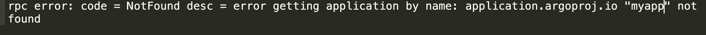

Vendor of the products:　argo

Reported by: 　　　　　 chunkl.hit@gmail.com

Affected products:　　　argo-cd

Vendor Homepage:       https://argo-cd.readthedocs.io/en/stable/

# Overview
Argo CD is a declarative, GitOps continuous delivery tool for Kubernetes. All versions of Argo CD have application enumeration issue.
 Argo CD fetch Application info before rbac check, which may lead a malicious user guess all applications name in the system even if he doesn't have privilege to access application module.

# Vul Details And Code in Application.go
Argo CD Application module's APIs fetch Application info before rbac check.
 If the application is not exit, APIs return msg info indicates the application doesn't exit in the system.

# Poc
The Application API (eg: /api/v1/applications/{name}/logs) return error msg.
