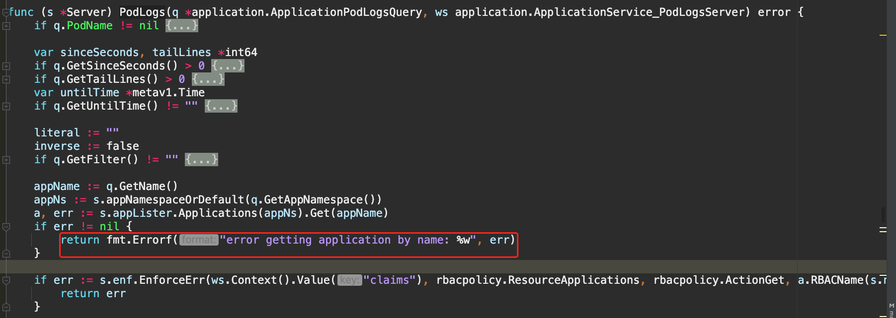
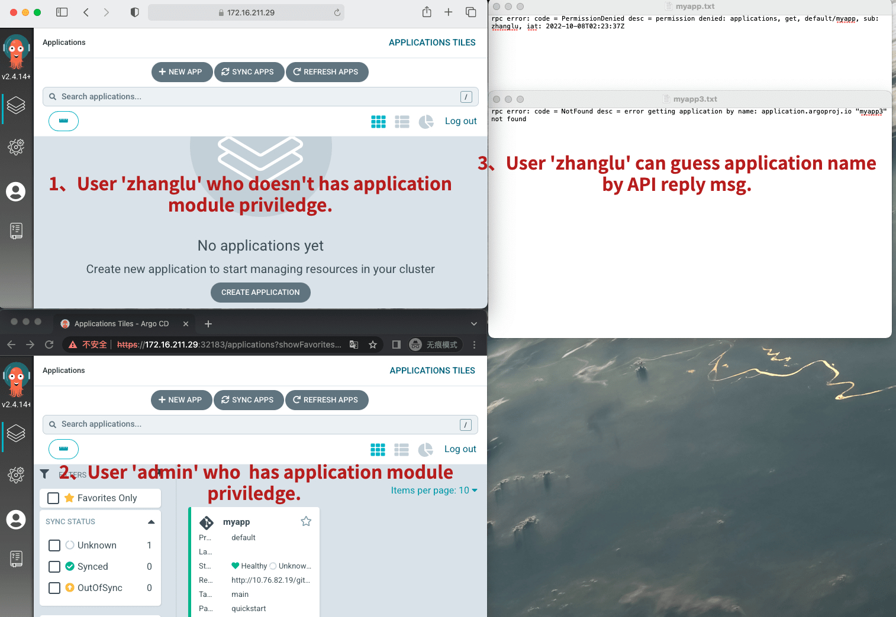
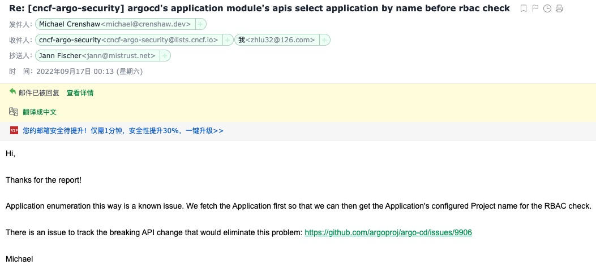

Vendor of the products:　Argo

Reported by: 　　　　　 bean.zhang of HIT-IDS ChunkL Team

Affected products:　　　Argo-CD

Vendor Homepage:       https://argo-cd.readthedocs.io/en/stable/

# Overview
Argo CD is a declarative, GitOps continuous delivery tool for Kubernetes. All versions of Argo CD before v2.4.14+ have application enumeration issue.
 Argo CD fetch Application info before rbac check, which may lead a malicious login user guess all applications name in the system even if he doesn't have privilege to access application module.

# Vul Details And Code in Application.go
Argo CD Application module's APIs fetch Application info before rbac check.
 If the application is not exit, APIs return msg info indicates the application doesn't exit in the system. 

# Poc
The Application API (eg: /api/v1/applications/{name}/logs) return error msg. 

# Reply by official argo 
The official argo reply by email: There is an issue to track the breaking API change that would eliminate this problem: https://github.com/argoproj/argo-cd/issues/9906

